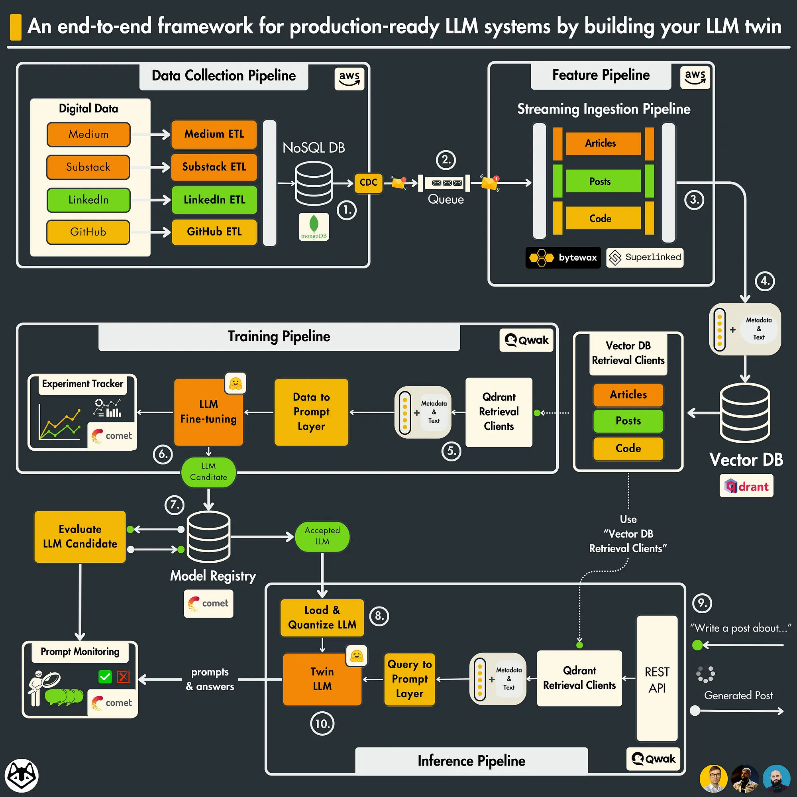
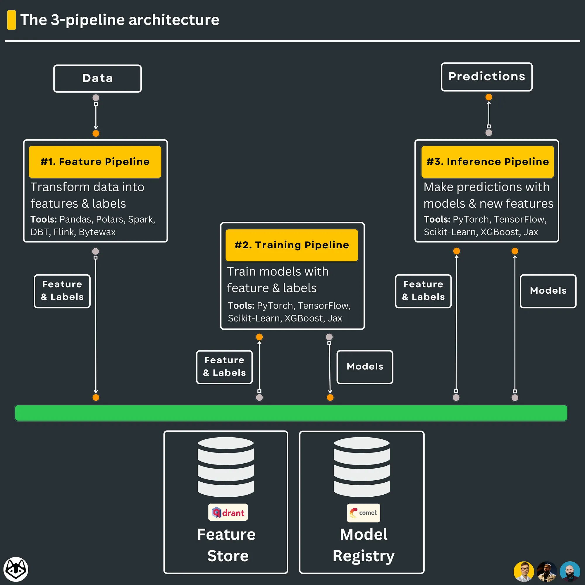
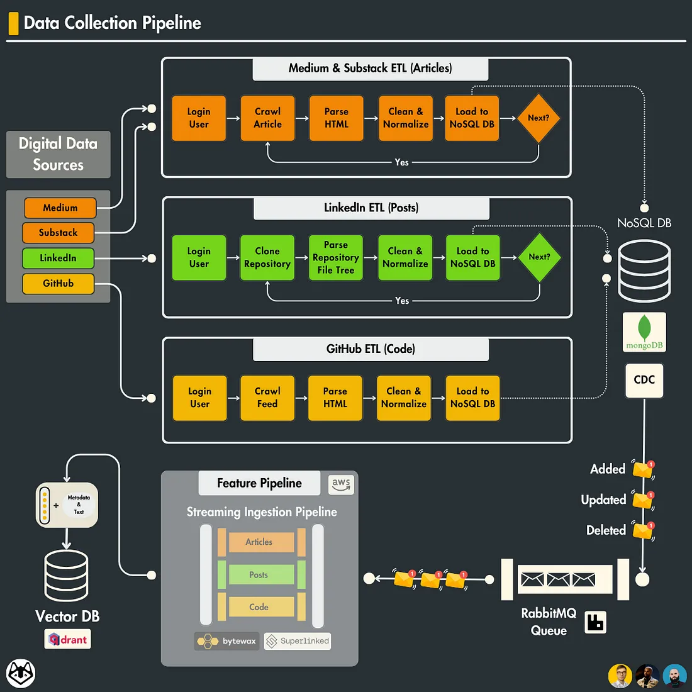
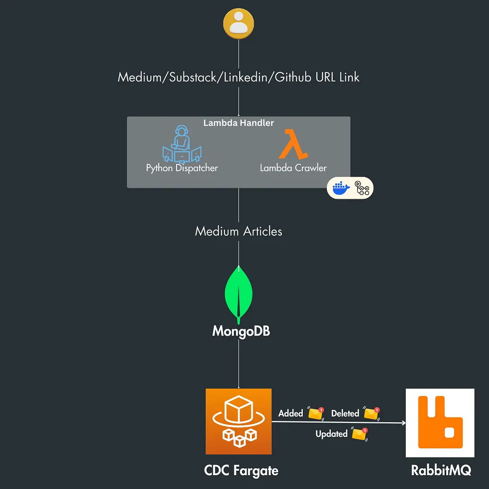

# LLM-Twin

## An End-to-End Framework for Production-Ready LLM Systems by Building Your LLM Twin

### Lesson 1: An End-to-End Framework for Production-Ready LLM Systems by Building Your LLM Twin overview 
 

#### **The 3-pipeline architecture:** 
(also known as the Feature/Training/Inference (FTI) architecture.)
 

1. The **feature pipeline:** transforms your data into features & labels, which are stored and versioned in a feature store. The feature store will act as the central repository of your features. That means that features can be accessed and shared only through the feature store.

2. The **training pipeline:** ingests a specific version of the features & labels from the feature store and outputs the trained model weights, which are stored and versioned inside a model registry. The models will be accessed and shared only through the model registry.

3. The **inference pipeline:** uses a given version of the features from the feature store and downloads a specific version of the model from the model registry. Its final goal is to output the predictions to a client.

### LLM Twin System design:
##### The architecture of the LLM twin is split into 4 Python microservices:
1. The data collection pipeline.
2. The feature pipeline.
3. The training pipeline.
4. The inference pipeline.

#### 1. data collection pipeline: 
As every platform is unique, we implemented a different Extract Transform Load (ETL) pipeline for each website.

🔗 read on [ETL pipelines](https://www.databricks.com/glossary/extract-transform-load)

However, the baseline steps are the same for each platform.

 
Thus, for each ETL pipeline, we can abstract away the following baseline steps:

- log in using your credentials
- use selenium to crawl your profile
- use BeatifulSoup to parse the HTML
- clean & normalize the extracted HTML
- save the normalized (but still raw) data to Mongo DB

[for more Informations](https://medium.com/decodingml/an-end-to-end-framework-for-production-ready-llm-systems-by-building-your-llm-twin-2cc6bb01141f)

---

###  Lesson 2: The Importance of Data Pipelines in the Era of Generative AI: 

[for more Informations](https://medium.com/decodingml/an-end-to-end-framework-for-production-ready-llm-systems-by-building-your-llm-twin-2cc6bb01141f)

---

### Lesson 3: Change Data Capture: Enabling Event-Driven Architectures

**Synchronized data** is data that is consistent and up-to-date across all systems and platforms it resides on or interacts with. It is the result of making sure that any change made in one dataset is immediately reflected in all other datasets that need to share that information.

** Change Data Capture (CDC)’s primary purpose** is to identify and capture changes made to database data, such as insertions, updates, and deletions.

#### *RabbitMQ Message Broker*
RabbitMQ is a reliable and mature messaging and streaming broker, which is easy to deploy on cloud environments, on-premises, and on your local machine. It is currently used by millions worldwide.

- Reliability: RabbitMQ guarantees reliable message delivery, ensuring that change events are conveyed to the Feature Pipeline, even in the face of temporary outages.
- Decoupling: This enables loose coupling between services, promoting autonomous operation and mitigating the propagation of failures across the system.
- Load Management: It evenly distributes the data load across multiple consumers, enhancing system efficiency.
- Asynchronous Processing: The system benefits from asynchronous processing, with RabbitMQ queuing change events for processing without delay.
- Scalability: RabbitMQ’s scalability features accommodate growing data volumes by facilitating easy addition of consumers and horizontal scaling.
- Data Integrity: It ensures messages are processed in the order they’re received, which is critical for data integrity.
- Recovery Mechanisms: RabbitMQ offers message acknowledgment and redelivery features, vital for recovery from failures without data loss.

--- 
### Architecture Overview
1. **Medium/Substack/Linkedin/Github URL Link:** These are the sources of content. The system starts with URLs from these platforms
2. **Lambda Handler:** This includes a Python Dispatcher and a Lambda Crawler which contains all types of crawlers. The Python Dispatcher is a component that decides which crawler to invoke based on the URL, while the Lambda Crawler is responsible for extracting the content from the provided URLs.
3. **MongoDB:** A NoSQL database used to store the crawled content.
4. **CDC Fargate:** This is a Change Data Capture (CDC) process running on AWS Fargate, which is a serverless compute engine for containers. CDC is used to capture and monitor changes in the database (like new articles added, or existing articles updated or deleted).
5. **RabbitMQ:** This is a message-broker software that receives messages about the changes from the CDC process and likely forwards these messages to other components in the system for further processing or notifying subscribers of the changes.

[for more Informations](https://medium.com/decodingml/the-3nd-out-of-11-lessons-of-the-llm-twin-free-course-ba82752dad5a)

